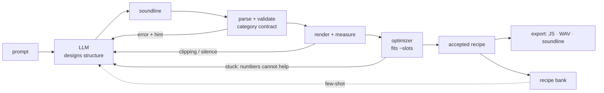

<p align="center">
  
</p>

<p align="center"><strong>Text-to-SFX as code. Sounds that weigh bytes, not megabytes.</strong></p>

<p align="center">
  <a href="LICENSE"></a>
  
  
</p>

---

Describe a sound effect in words and get back **compact procedural Web Audio code** —
typically 300–1000 bytes, zero dependencies — instead of an audio file. The philosophy is
*reconstruction by code*: a `.wav` is a recording of a sound, while a few hundred bytes of
JavaScript is a *description* of one, and a description can be read, diffed, retuned and
shipped inside a bundle.

Between the prompt and the code sits a text format, `soundline`, which is the actual unit
of exchange. A language model writes it, a validator checks it against the physics of the
category it claims to be, a renderer measures it, and a numerical optimizer fits every
number the model was unsure about. The model designs structure; scripts decide everything
that can be decided by measurement.

Nothing is proxied through a service. The LLM is yours — paste a Gemini key into the
playground, or point the loop at Anthropic, or run it with no key at all against the recipe
bank. An outside agent can use the whole thing without installing it: one request to
`GET /api/llms.txt` returns the complete grammar, the parameter tables and working
examples.

## The killer example

This is a complete sound — a game bubble pop, matched against a reference recording:

```
sound "bubble pop" 55ms pop
  body: tone tri ~700Hz[500..1400] -> 1120Hz in 14ms >> lp ~2200Hz[900..4000] Q1 | gain 0.8 hold 3ms decay 38ms
  edge: click 1ms >> bp ~2800Hz[1200..6000] Q1 | gain 0.38 attack 0ms decay 6ms
```

Three lines. `~700Hz[500..1400]` means "about 700, fit it between 500 and 1400" — the
optimizer's search space, and a slider in the playground. Here is what it compiles to, in
full, at **876 bytes**, with no dependencies and no assets (line breaks added for reading;
it is emitted on one line):

```js
(c, w = 0) => {
  const R = c.sampleRate, D = c.destination,
    A = s_ => c.createBuffer(1, R * s_ | 0 || 1, R),
    U = (s_, d_) => {                       // procedural white noise, exponentially damped
      const b = A(s_), a = b.getChannelData(0), n = a.length; let s = d_;
      for (let i = 0; i < n; i++) { s = s * 16807 % 2147483647; a[i] = (s / 1073741824 - 1) * Math.exp(-3 * i / n) }
      return b
    },
    S = (p, v, t) => p.setValueAtTime(v, w + t),
    X = (p, v, t) => p.exponentialRampToValueAtTime(v, w + t),
    N = (a, b) => a.connect(b), G = () => c.createGain(), F = () => c.createBiquadFilter(),
    b0 = U(.001, 343513664),
    n0 = c.createOscillator(), n1 = G(), n2 = F(),
    n3 = c.createBufferSource(), n4 = G(), n5 = F(),
    p0 = n0.frequency, p1 = n1.gain, p2 = n4.gain;
  n0.type = "triangle"; n2.frequency.value = 2200;
  n3.buffer = b0; n5.type = "bandpass"; n5.frequency.value = 2800;
  S(p0, 700, 0); X(p0, 1120, .014);                    // the rising resonance
  S(p1, 0, 0); p1.linearRampToValueAtTime(.8, w + .001); S(p1, .8, .004); X(p1, .001, .042);
  S(p2, .38, 0); X(p2, .001, .006);                    // the edge
  N(n0, n1); N(n1, n2); N(n2, D); N(n3, n4); N(n4, n5); N(n5, D);
  n0.start(w); n0.stop(w + .042); n3.start(w); n3.stop(w + .001)
}
```

Drop that in a game and call it with an `AudioContext`. The exported function and the live
graph you hear in the playground are printed from **one** intermediate representation, so
the export is not a reimplementation: on all ten reference recipes the two render
byte-identically.

## The cycle



## Quick start

```powershell
npm install -g pnpm@10        # corepack is gone from Node 25
pnpm install
pnpm test                     # 632 tests
pnpm dev                      # playground on http://localhost:5173
```

In the playground: type what you want to hear, pick a model, paste your key. The key lives
in that tab's memory and is sent to that vendor and nowhere else — no proxy, no server of
ours in the path. Ticking **remember** encrypts it with a non-extractable key in IndexedDB
rather than storing it in `localStorage`; what that does and does not protect against is
spelled out in `apps/web/src/lib/keystore.ts`, and **forget** undoes it. With **mock** selected there is no key and no network
at all: the answer comes from the recipes already on the page, and the rest of the loop —
validator, render, optimizer, export — runs exactly as it does with a real model.

Under `pnpm dev` the Compare panel can also produce its own reference: **⤓ Render target**
sends the same prompt to Stable Audio Open Small running locally, and loads the result as
the reference to A/B against, fit sliders to, and tick **match reference** for. That is a
diffusion render used as the *target*, not as the output — the shipped artifact is still a
recipe. It needs the one-time provisioning in [test/stable-audio/README.md](test/stable-audio/README.md),
and nothing about it exists in a static build.

The recipe bank runs as its own process and needs no native build — it uses Node's built-in
`node:sqlite`:

```powershell
pnpm --filter @txt2sfx/server seed     # renders examples/ into a SQLite bank
pnpm --filter @txt2sfx/server start    # http://127.0.0.1:8787
curl http://127.0.0.1:8787/api/llms.txt
```

`node:sqlite` needs a Node whose SQLite was compiled with FTS5 — 22.16+, none of 23.x, or
24+. The server probes for it at startup and says so plainly rather than failing with a
confusing SQL error.

Use the library directly:

```ts
import { codegen, parse, renderSound, serialize, validate } from '@txt2sfx/core';

const ast = parse('sound "pop" 35ms pop\n  body: tone sine 480Hz | gain 0.9 decay 30ms\n');
serialize(ast);                        // canonical, byte-stable soundline
validate(ast);                         // invariants, each with a fix phrased for a model
codegen(ast);                          // { code, bytes, withinBudget }
await renderSound(ast, { context });   // { buffer, ir, peak, clipped, durationMs }
```

Or run the loop:

```ts
import { generateSound, geminiProvider, httpBank } from '@txt2sfx/agent';

const result = await generateSound({
  prompt: 'coin pickup sound for a platformer',
  provider: geminiProvider({ apiKey }),      // your key, your machine
  render: renderSignal,                      // audio stack injected
  bank: httpBank('http://127.0.0.1:8787'),   // few-shot from solved sounds
});
```

And score the pipeline:

```powershell
pnpm bench                     # scripted model, no key, reproducible
pnpm bench -- --provider gemini
```

## The language

```
sound "<name>" <duration> [<category>] [loop]
  <layer>: <primitive> <args> [>> <effect> <args>]... | <envelope>
```

Nine sources and six effects, all procedural:

| sources | | effects | |
| --- | --- | --- | --- |
| `tone` | pitched body — sine, tri, square, saw | `lp` `hp` `bp` | biquad filters |
| `noise` | white, pink, brown texture | `dist` | waveshaper grit |
| `chirp` | fast frequency sweep | `delay` | echo, or recirculation as texture |
| `pluck` | plucked string | `verb` | cheap room; the tail outlives the decay |
| `modal` | struck-object partials — metal, wood, glass | | |
| `fm` | two-operator FM | | |
| `sub` | the part you feel | | |
| `click` | pure transient | | |
| `grains` | a field of many small events — water, rain, gravel, fire | | |

The category is not a label but a contract: `pop` promises 8–60 ms with no frequency ramp
longer than 20 ms, and a validator enforces it — which is what stops a model from handing
you a cartoon laser under the name of a bubble pop. Full grammar in
[docs/SOUNDLINE_GRAMMAR.md](docs/SOUNDLINE_GRAMMAR.md); the exhaustive parameter tables are
generated from the parser's own tables and served at `/api/llms.txt`.

## Honesty about limits

- **Procedural synthesis is strong at SFX** — impacts, clicks, zaps, UI feedback, sci-fi,
  mechanical textures — and **weak at organic sound**: voice, believable animals, complex
  real-world recordings. Ask for a human voice and the loop is instructed to say no rather
  than produce something disappointing.
- **"300–1000 bytes" is a typical SFX, not a guarantee.** Two-layer recipes land at
  531–876 bytes; three- and four-layer ones run 1.1–1.7 KB, because the procedural buffer
  generators are a fixed cost — and that cost is exactly what buys a project with no audio
  assets. The compiler always emits complete working code and reports what it cost.
- **Similarity judgement is still numeric.** The optimizer minimizes a spectral and
  envelope distance, which is not the same as "sounds like the thing". The metric is
  scale-normalized and onset-aligned, so it cannot distinguish *this sound, closer* from
  *a different sound that happens to score well* — a broadband wash with the right
  envelope and centroid outscores a recognizable version of what was asked for. The fit is
  therefore anchored to the recipe the model designed rather than left free to chase the
  number (`anchor`, `initialSpread` in [AGENT_LOOP.md](docs/AGENT_LOOP.md)), it is
  watchable and playable generation by generation, and it can be stopped without losing
  what it found. None of that makes the metric hear. A CLAP judge and vision-model
  comparison of spectrograms are v0.2.
- **One reference recipe knowingly breaks an invariant.** `helicopter` rings for about four
  seconds behind a header claiming 1.5, because its rotor *is* a delay line with high
  feedback. It is loaded into the bank with the error reported rather than hidden, and the
  agent's few-shot selection prefers recipes that validate, so nothing learns from it.

## Docs

| | |
| --- | --- |
| [ARCHITECTURE.md](docs/ARCHITECTURE.md) | packages, the full cycle, and why there is one DSP with two players |
| [SOUNDLINE_GRAMMAR.md](docs/SOUNDLINE_GRAMMAR.md) | the language and the reasons behind its shape |
| [PRIMITIVES.md](docs/PRIMITIVES.md) | what each primitive is for, deviations, measured peaks and sizes |
| [ACOUSTIC_PROFILE.md](docs/ACOUSTIC_PROFILE.md) | what is measured, the metric, and the numbers to compare against |
| [AGENT_LOOP.md](docs/AGENT_LOOP.md) | providers, the repair loop, and when the model may change structure |
| [API.md](docs/API.md) | the recipe bank's REST surface |
| [bench/README.md](bench/README.md) | SFX-Bench v0, and how to add a target |
| [ROADMAP.md](ROADMAP.md) · [CONTRIBUTING.md](CONTRIBUTING.md) | where this is going, and how to help |

## Repository layout

| Path | What lives there |
| --- | --- |
| `packages/shared` | Types and physical limits per sound category. Zero deps. |
| `packages/core` | DSL, validator, primitives, compiler, IR, render, JS codegen. Zero deps. |
| `packages/analyzer` | FFT, acoustic profiles, distance metrics, human-readable diffs. Zero deps. |
| `packages/optimizer` | Differential evolution over a recipe's `~value[min..max]` slots. Zero deps. |
| `packages/agent` | LLM providers, the contract document, the generate-and-repair loop. Zero deps. |
| `apps/web` | Vite + React playground: prompt, generate, edit, hear, measure, compare, export, publish. |
| `apps/server` | Recipe bank: SQLite + FTS5 behind a small REST API, plus `/api/llms.txt`. |
| `bench` | SFX-Bench v0: reference targets and the scoring run. |
| `examples/` | Ten reference recipes, also used to seed the recipe bank. |
| `.plans/` | The v0 build plan, phase by phase, with every deviation and why. |

## License

[Apache-2.0](LICENSE)
