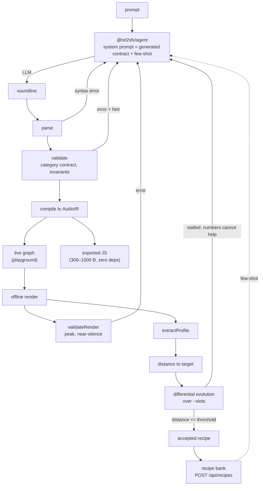

# Architecture

## The four principles

Every decision in this repository is downstream of these, and any of them is a valid
argument in a code review:

1. **Scripts enforce, the model judges.** Parsing, validation, rendering, metrics and
   scoring are deterministic code with no model in the loop. A language model does two
   things: design the structure of a sound, and judge perceptual similarity.
2. **Spec-first, fail fast.** Code generation does not start until the spec has passed
   the physical-invariant validator. Generated JavaScript is never repaired — the
   soundline is repaired and the JavaScript is regenerated.
3. **Structure and numbers are separate.** The model chooses layers, primitives and
   effects; a numerical optimizer fits the exact values against a target profile.
4. **The output is readable text.** The unit of exchange is `soundline`, and it is
   diffable.

## Packages

```
packages/shared      types, category limits, global limits — plain data, no behaviour
packages/core        the language: lexer, parser, serializer, validator, compiler,
                     two backends (live graph, exported JS), renderer, WAV writer
packages/analyzer    FFT, acoustic profile, distance metrics, human-readable diff
packages/optimizer   differential evolution over `~value[min..max]` slots
packages/agent       LLM providers, the contract document, the generate → repair loop
apps/server          recipe bank: SQLite + FTS5 behind a small REST API
apps/web             the playground: editor, sliders, visualizer, compare, export
bench                SFX-Bench v0: run the pipeline against reference targets
examples/            ten reference recipes, in canonical form
```

`shared`, `core`, `analyzer`, `optimizer` and `agent` have **zero runtime
dependencies** — the FFT, the WAV encoder, the differential evolution and the HTTP
providers are all local. Dependencies live in `apps/` (Fastify, React, Vite) and in
devDependencies (`node-web-audio-api`, vitest, TypeScript). The audio stack is
*injected*: `core` takes a factory for `OfflineAudioContext`, and both the optimizer
and the agent take a render function. Nothing below `apps/` constructs an audio
context, which is why the same code runs in Node, in a browser tab and in a test.

## The full cycle



The dotted edge is the loop that makes the project accumulate: every solved sound
becomes retrieval material for the next prompt. It is also the edge that needs care —
see the few-shot filtering rule in [AGENT_LOOP.md](AGENT_LOOP.md).

## The central decision: one DSP, two players

The obvious design has `graph.ts` build live `AudioNode`s and `codegen.ts` independently
print JavaScript. That means **two implementations of the same DSP** — eight primitives
and six effects, written twice and required to agree down to the sample. They would
diverge, and the divergence would be inaudible until it mattered.

So the DSP lives in one place. `compile/ir.ts` defines `AudioIR`: a description of the
graph that is independent of sample rate and of whether an audio stack exists at all.
Primitives and effects emit IR. Both backends are dumb players — `graph.ts` instantiates
nodes, `codegen.ts` prints strings.

The payoff is a test that would otherwise be impossible: the parity test compares **two
players of one description**, so it can demand not "RMS within tolerance" but
*byte-identical renders*. On all ten examples, `maxAbsDiff === 0`.

Consequences worth knowing before changing anything here:

- `PrimitiveDef.build(args, ctx)` receives a `BuildContext` carrying `ir`, `seed`,
  `start` and `stop` — never an `AudioContext`.
- IR times are seconds **relative to the onset of the sound**; the `when` offset is
  added by the backend, because the exported function takes it as an argument.
- `quantizeIR` rounds every number to six decimals *once, before both backends*. This
  is not cosmetic: without it the export would either carry `0.191891363534` or round it
  differently, and a rounded buffer length shifts every sample relative to the
  reference. One rounding, before the fork, is the reason parity is exact.

## Rendering and export

`renderSound` renders offline at 44.1 kHz with a deterministic seed, pads the tail, and
**reports** clipping without ever normalizing. Normalization would hide the problem
exactly where it can still be fixed properly — in the spec.

`codegen` returns `{ code, bytes, withinBudget }` and always returns working code.
`withinBudget` (1 KB) is a report, not a gate: two-layer recipes fit comfortably, and
three- and four-layer recipes exceed it by 7–67 % because the procedural buffer
generators are a fixed cost — which is the price of shipping no assets at all. Silently
truncating the export, or refusing to emit it, would be worse than telling the caller
what it costs. See [PRIMITIVES.md](PRIMITIVES.md) for the measured sizes.

## Testing posture

- Tests run straight off TypeScript sources (vitest aliases each package to its
  `src/index.ts`), so a change in `shared` is visible to `core`'s tests immediately and
  no stale `dist/` can pass.
- `tsc -b` builds sources; `tsconfig.test.json` type-checks sources **and tests**,
  because a test that fails to type usually still runs.
- The audio stack appears only in test helpers and in the two places that legitimately
  own one (the seeder, the bench). Anything that holds samples longer than the context
  that produced them **copies** them: `getChannelData` returns a view into memory the
  native context owns, and the symptom of holding it is a signal that silently turns to
  NaN and then a process death with no JavaScript stack.
- `.gitattributes` forces LF. Without it the byte-exact round-trip tests fail on
  Windows.

## Where the seams are

If you are adding something, these are the extension points that already exist:

| You want to | Do this |
| --- | --- |
| add a primitive or effect | add a `Signature` in `grammar/signatures.ts` and a def that emits IR. The parser, serializer, contract document and docs tables all follow from the signature. |
| add an invariant | append a rule to `INVARIANTS`; it is an array for exactly this reason |
| change the fitness | `analyzer/distance.ts`; the weights are named constants |
| support another model vendor | implement `LLMProvider` (one method) in `packages/agent` |
| judge similarity with a model or CLAP | the interface is the same `Target`/distance shape; v0.2 in `ROADMAP.md` |
